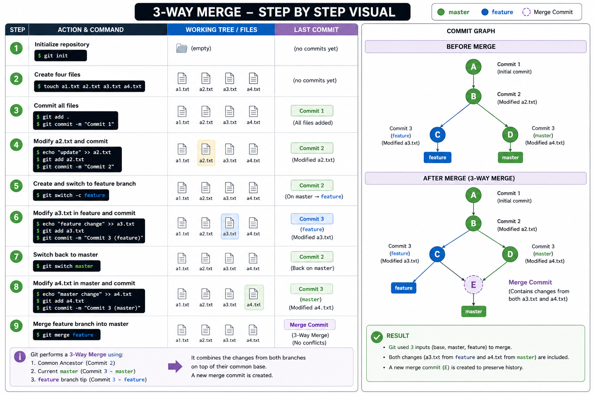

# 04 - Merging


## What is Merging?

Merging means **combining the changes from one branch into another branch**.

After completing work on a feature branch, we usually merge it into the **main/master** branch so that everyone's changes become part of the main project.

Git provides the following command for merging:

```bash
git merge branch-name
```

### Example

```bash
git switch master
git merge feature-1
```

This command merges the **feature-1** branch into the **master** branch.

> **Important:** Always switch to the branch where you want the changes before running `git merge`.

You can verify your current branch using:

```bash
git branch
```

or

```bash
git status
```

---

# Types of Merge

Git mainly performs two types of merge:

1. Fast-Forward Merge
2. Three-Way Merge

---

# 1. Fast-Forward Merge

A Fast-Forward merge happens when the target branch has **not received any new commits** after the feature branch was created.

Since there is no different history to combine, Git simply moves the branch pointer forward.

No extra merge commit is created.

## Diagram

```
Before Merge

master
  |
A --- B

       \
feature  C --- D


After Merge

master
        |
feature  |
A --- B --- C --- D
```

Notice that the history remains a straight line.

---

## Task - Perform a Fast-Forward Merge

### Step 1

Create a new repository.

```bash
git init
```

---

### Step 2

Create four files.

```
a1.txt
a2.txt
a3.txt
a4.txt
```

---

### Step 3

Commit all files.

```
Commit 1
```

---

### Step 4

Modify **a2.txt**

Commit again.

```
Commit 2
```

---

### Step 5

Create and switch to a new branch.

```bash
git switch -c feature
```

---

### Step 6

Modify **a3.txt**

Commit it.

```
Commit 3
```

---

### Step 7

Modify **a4.txt**

Commit it.

```
Commit 4
```

---

### Step 8

Switch back to master.

```bash
git switch master
```

---

### Step 9

Merge the feature branch.

```bash
git merge feature
```

Since master didn't receive any new commits after the branch was created, Git performs a **Fast-Forward Merge**.

No merge commit is created.

---

# 2. Three-Way Merge

A Three-Way Merge happens when **both branches have new commits** after they split.

Git cannot simply move the pointer because both branches contain different work.

Instead, Git creates a **new merge commit** that combines both histories.

---

## Diagram

```


```

**M** is the merge commit.

---

## Task - Perform a Three-Way Merge

### Step 1

Initialize a repository.

```bash
git init
```

---

### Step 2

Create four files.

```
a1.txt
a2.txt
a3.txt
a4.txt
```

Commit all files.

```
Commit 1
```

---

### Step 3

Modify **a1.txt**

Commit it.

```
Commit 2
```

---

### Step 4

Create a feature branch.

```bash
git switch -c feature
```

---

### Step 5

Modify **a2.txt**

Commit it.

```
Commit 3
```

---

### Step 6

Modify **a3.txt**

Commit it.

```
Commit 4
```

---

### Step 7

Switch back to master.

```bash
git switch master
```

---

### Step 8

Modify **a4.txt**

Commit it.

```
Commit 5
```

Now both branches have different commits.

---

### Step 9

Merge feature into master.

```bash
git merge feature
```

Git creates a **Merge Commit** because both branches have moved independently.

---

# Merge Conflict

A Merge Conflict happens when two branches modify the **same part of the same file**.

Git cannot decide which version should be kept, so it asks you to resolve the conflict manually.

---

## Example

Suppose both branches edit the same line.

When you merge, Git shows something like this:

```text
<<<<<<< HEAD
Hello from master
=======
Hello from feature
>>>>>>> feature
```

### Meaning

- `<<<<<<< HEAD` → Current branch version
- `=======` → Separator
- `>>>>>>> feature` → Incoming branch version

---

## How to Resolve a Conflict

### Step 1

Open the conflicted file.

---

### Step 2

Choose the final content.

You can

- Keep the current version
- Keep the incoming version
- Combine both versions

---

### Step 3

Delete all conflict markers.

Remove

```text
<<<<<<<
=======
>>>>>>>
```

---

### Step 4

Stage the resolved file.

```bash
git add filename
```

---

### Step 5

Complete the merge.

```bash
git commit
```

Git creates a merge commit.

---

# Cancel a Merge

If you don't want to continue resolving the conflict, you can cancel the merge.

```bash
git merge --abort
```

Git returns the repository to the state before the merge started.

---

# Task - Create a Merge Conflict

### Step 1

Create a repository.

```bash
git init
```

---

### Step 2

Create a file.

```
a1.txt
```

Content

```
Hello World
```

Commit it.

---

### Step 3

Create a feature branch.

```bash
git switch -c feature
```

---

### Step 4

Change the content.

```
Hello from feature
```

Commit it.

---

### Step 5

Switch back to master.

```bash
git switch master
```

---

### Step 6

Modify the same line.

```
Hello from master
```

Commit it.

---

### Step 7

Merge the feature branch.

```bash
git merge feature
```

Git reports a merge conflict.

---

### Step 8

Open the file.

Remove the conflict markers.

Write the final content.

Example

```
Hello from Master and Feature
```

---

### Step 9

Stage the file.

```bash
git add a1.txt
```

---

### Step 10

Finish the merge.

```bash
git commit
```

---

# View Merge History

To visualize the commit history:

```bash
git log --oneline --graph --all
```

### Fast-Forward Merge

```
A --- B --- C --- D
```

A straight line.

---

### Three-Way Merge

```
        C --- D
       /       \
A --- B         M
       \       /
        E -----
```

The history splits and joins again.

---

# Force a Merge Commit

Sometimes you want Git to create a merge commit even if a Fast-Forward merge is possible.

Use:

```bash
git merge --no-ff branch-name
```

This keeps the branch history visible and clearly shows when a feature branch was merged.

---

# Summary

- Merging combines one branch into another.
- Always switch to the destination branch before merging.
- Fast-Forward Merge creates **no merge commit**.
- Three-Way Merge creates **one merge commit**.
- Merge conflicts occur when the same lines are modified in both branches.
- Resolve conflicts manually, stage the file, and commit.
- Use `git merge --abort` to cancel an unfinished merge.
- Use `git log --oneline --graph --all` to visualize merge history.

---

### 📖 Next Chapter

In the next chapter, you'll learn how to **undo changes safely** using commands like `git reset`, `git restore`, `git revert`, `git cherry-pick`, and `git rebase`.

➡️ **Next:** [05 - Undoing Changes](05-Undoing.md)
