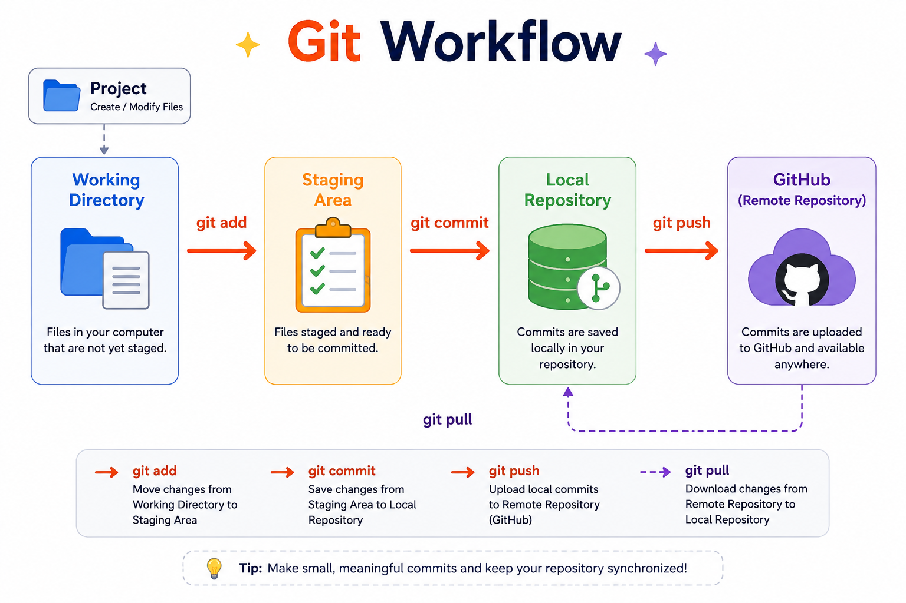

# 01 - Git Introduction

> **Welcome to Git Notes!**

This repository is designed to help beginners learn Git step by step using simple explanations, real examples, diagrams, and hands-on practice.

Every chapter builds on the previous one, so it's recommended to read them in order.

---

# What You'll Learn

By the end of this chapter, you will understand:

- What Git is
- Why Git is needed
- What a Version Control System (VCS) is
- Types of Version Control Systems
- Why Git is so popular
- Difference between Git and GitHub
- Git working areas
- How to install and configure Git

---

# Why Should You Learn Git?

Imagine you're developing a project for several weeks.

Today your project works perfectly.

Tomorrow you accidentally delete an important file.

How will you get it back?

Or imagine three developers are working on the same project.

Developer A changes the Login page.

Developer B changes the Login page too.

When both upload their work, one person's changes may overwrite the other's.

Without proper version control, managing software becomes difficult.

This is exactly why Git was created.

---

# What is Git?

Git is a **Distributed Version Control System (DVCS)**.

It helps developers save different versions of their project and keeps a complete history of every change made to the source code.

For every commit, Git records:

- Who made the change
- What was changed
- When the change was made

Git was developed by **Linus Torvalds** in **2005**.

---

# What is Version Control?

Version Control is the process of managing different versions of a project over time.

Instead of saving files like:

Project_Final

Project_Final_New

Project_Final_Last

Project_Final_Last2

Git stores every version automatically and lets you return to any previous version whenever needed.

---

# Real-Life Example

Suppose a company is building an E-Commerce website.

The work is divided among developers.

Developer 1 → Home Page

Developer 2 → Login Page

Developer 3 → Cart Page

Developer 4 → Payment Module

Everyone completes their work and copies their files into one shared folder.

Now imagine:

- One developer accidentally replaces another person's file.
- Nobody knows who modified the code.
- A bug appears after deployment.
- The manager wants to know who introduced the bug.

Without version control, answering these questions becomes almost impossible.

Git solves all these problems by maintaining the complete history of every change.

---

# Types of Version Control Systems

There are three types of Version Control Systems.

## 1. Local Version Control System (LVCS)

A Local VCS stores all versions only on one computer.

### Advantages

- Easy to use
- Works without internet

### Disadvantages

- No collaboration
- Data can be lost if the computer fails

Examples

- RVCS(Revision version control system)
- SCCS(Source code control system)

---

## 2. Centralized Version Control System (CVCS)

A Centralized VCS stores the entire project history on one central server.

Developers connect to this server to download and upload changes.

### Advantages

- Easy collaboration
- Central backup

### Disadvantages

- Internet is required
- Server failure stops everyone's work
- Single point of failure

Examples

- SVN (Subversion)
- Perforce

---

## 3. Distributed Version Control System (DVCS)

A Distributed VCS gives every developer a complete copy of the project history.

Developers can continue working even if the internet or server is unavailable.

### Advantages

- Faster
- Works offline
- Better collaboration
- Very safe

Examples

- Git
- Mercurial
- Bazaar

---

# Why Do Most Companies Use Git?

Git is popular because it is:

- Free
- Open Source
- Fast
- Reliable
- Secure
- Lightweight
- Works offline
- Supports branching and merging
- Used by almost every software company

---

# Git vs GitHub

Many beginners think Git and GitHub are the same thing.

They are different.

| Git | GitHub |
|------|---------|
| Version Control System | Cloud Hosting Platform |
| Installed on your computer | Runs on the Internet |
| Tracks project history | Stores Git repositories |
| Can work offline | Requires Internet |

Other Git hosting platforms include GitLab, Bitbucket, and Azure Repos.

---

# Installing Git

Download Git from:

https://git-scm.com/

Install it using the default settings.

After installation, verify it by running:

```bash
git --version
```

Example:

```text
git version 2.xx.x
```

---

# Configure Git

Git stores your identity with every commit.

Set your username:

```bash
git config --global user.name "Your Name"
```

Set your email:

```bash
git config --global user.email "your@email.com"
```

Check the configuration:

```bash
git config --list
```

---

# Git Working Areas

Once you initialize Git, your project moves through four stages.



## 1. Working Directory

This is where you create, edit, and delete files.

Example:

```
index.html
style.css
app.js
```

---

## 2. Staging Area

Files are moved here using:

```bash
git add .
```

Think of it as a waiting area before committing.

---

## 3. Local Repository

Files are permanently saved using:

```bash
git commit -m "msg"
```

Each commit creates a new version of the project.

---

## 4. Remote Repository

The remote repository is an online copy of your project stored on platforms like GitHub.

Common commands:

```bash
git push

git pull

git fetch
```

---

# Hands-on Practice

✅ Install Git

✅ Configure your username

✅ Configure your email

✅ Verify your Git version

✅ Check your configuration

---

# Common Mistakes

❌ Forgetting to configure username

❌ Forgetting to configure email

❌ Thinking Git and GitHub are the same

❌ Believing Git requires internet for every command

---

# Interview Questions

1. What is Git?

2. What is Version Control?

3. Why do we use Git?

4. Difference between Git and GitHub?

5. What are the types of Version Control Systems?

6. What is a Distributed Version Control System?

7. Who developed Git?

8. What information does Git store for every commit?

9. Explain the Git working areas.

10. Why is Git popular?

---

# Summary

In this chapter, you learned:

- Why Git was created
- What Version Control is
- Types of Version Control Systems
- Difference between Git and GitHub
- Git working areas
- Basic Git configuration

These concepts form the foundation of everything you'll learn next.

---

## Next Chapter

Now that you understand **what Git is** and **why it is used**, it's time to learn **how Git works in a real project**.

➡️ **Next:** [02 - Git Workflow](02-Workflow.md)
